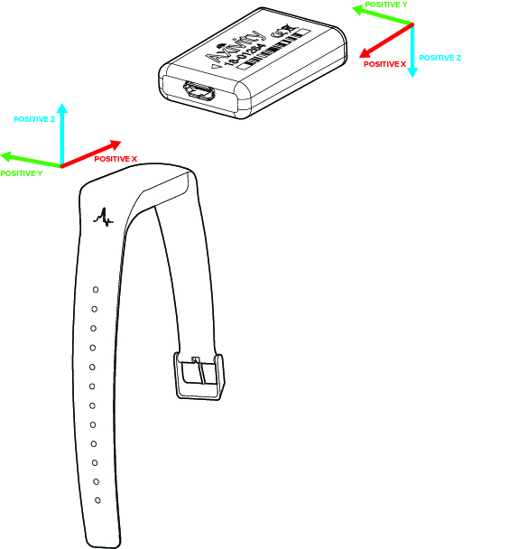
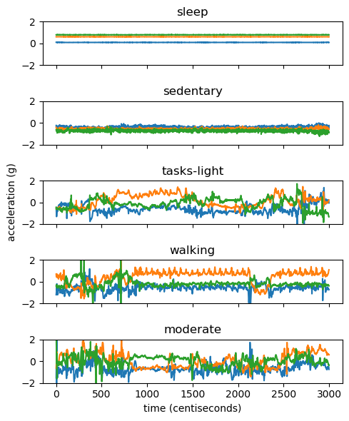
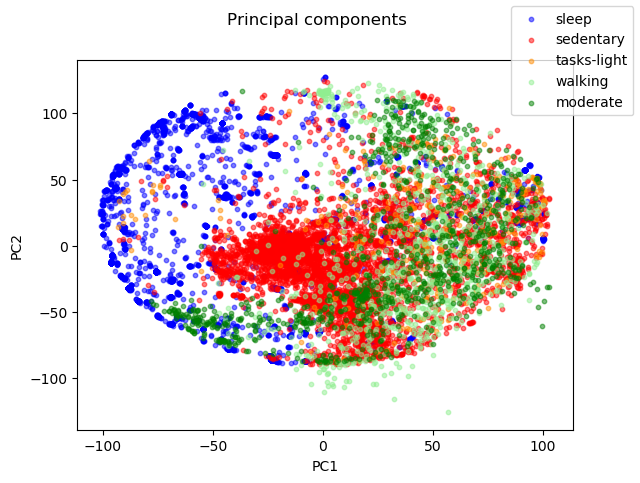
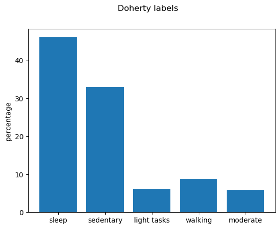
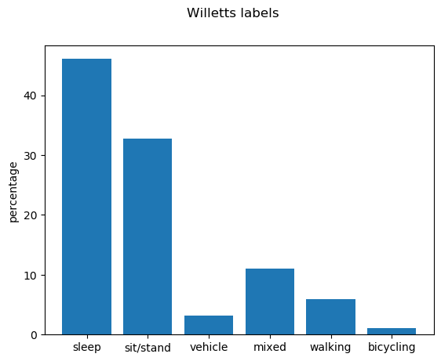

# Capture24 dataset

<p align="center">

</p>

The Capture24 dataset consists of wrist-worn accelerometer measurements
collected from around 150 participants that wore the device for 24 hours.
Along with the accelerometer, the participants also wore a body camera that
recorded their daily activities. To track their sleep, participants were asked to write sleep diaries (as they do not wear the cameras during
sleep).
Trained humans then annotated the accelerometer recordings based on the camera information and sleep diaries. The resolution of the annotation is 1 every 30 seconds (i.e. one annotation per each non-overlapping segment of 30 seconds).

## Download

_capture24.zip_ (3.2GB)

### Content description

The zip folder contains seven numpy array files (`.npy` files):

- `X_raw` (12GB) array of shape `(N,3,3000)` where each row corresponds to an instance of 30 seconds of raw tri-axial measurement at 100Hz.

- `X_feats` (176MB) array of shape `(N,125)` containing *hand-crafted features* extracted from `X_raw`, i.e. each instance measurement of shape `(3,3000)` is condensed into 125 values. These values are a collection of features used in published literature such as mean acceleration, covariances between axes, Fourier coefficients, estimated angles, etc.
For details, see *References* at the bottom.

- `participant` (3MB) array of shape `(N,)` indicating the participant ID for each instance.

- `annotation` (361MB) array of shape `(N,)` containing fine-grained descriptions of the activity performed during each instance. Examples:

    ```bash
    '7030 sleeping',
    'transportation;public transportation;16016 riding in a bus or train',
    'occupation;agriculture/forestry/fishing;11540 shovelling digging ditches',
    'leisure;sports;water activities;18012 boating power passenger',
    ```

    The numeric code in the annotations is based on the [compendium of physical activity](https://sites.google.com/site/compendiumofphysicalactivities/home).

- `time` (3MB) array of shape `(N,)` indicating the start time for each instance.

- `y_doherty` (3MB) array of shape `(N,)` assigning an activity label to each instance. This condenses `annotation` into *five* categories as used in
[Doherty et. al. 2018](https://www.nature.com/articles/s41467-018-07743-4). The labels are codified as follows: 0=**sleep**, 1=**sedentary**, 2=**light tasks**, 3=**walking**, 4=**moderate** (Hint: it goes from lower to higher activity).

- `y_willetts` (3MB) array of shape `(N,)` assigning an activity label to each instance. This condenses `annotation` into *six* categories as used in
[Willetts et. al. 2018](https://www.nature.com/articles/s41598-018-26174-1). The labels are codified as follows: 0=**sleep**, 1=**sit/stand**, 2=**vehicle**, 3=**mixed**, 4=**walking**, 5=**bicycling** (Hint: it goes from lower to higher activity).

## Visualization

- Raw signal

    

- Principal components

    

- Distribution of labels

    
    

## Activity recognition

See the provided example code `activity_recognition.ipynb` using a random forest + hidden Markov model on the Capture24 for human activity recognition.

## References

- Successful use cases of Capture24:

  - [Statistical machine learning of sleep and physical activity phenotypes from sensor data in 96,220 UK Biobank participants](https://www.nature.com/articles/s41598-018-26174-1)
  - [GWAS identifies 14 loci for device-measured physical activity and sleep duration](https://www.nature.com/articles/s41467-018-07743-4)

- Source of hand-crafted features:

  - [Physical activity classification using the GENEA wrist-worn accelerometer](https://www.ncbi.nlm.nih.gov/pubmed/21988935)
  - [A universal, accurate intensity-based classification of different physical activities using raw data of accelerometer](https://www.ncbi.nlm.nih.gov/pubmed/24393233)
  - [Activity recognition using a single accelerometer placed at the wrist or ankle](https://www.ncbi.nlm.nih.gov/pubmed/23604069)
  - [Hip and Wrist Accelerometer Algorithms for Free-Living Behavior Classification](https://www.ncbi.nlm.nih.gov/pubmed/26673126)
