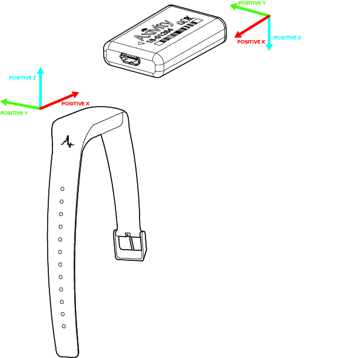

# Activity recognition with the Capture24 dataset

Check out `tutorial.py` or `tutorial.ipynb` for data exploration on Capture24. 

The Capture-24 dataset can be downloaded [here](https://ora.ox.ac.uk/objects/uuid:92650814-a209-4607-9fb5-921eab761c11)

To run the examples, you will need numpy, pandas, sklearn, [imblearn](https://pypi.org/project/imblearn/) and [tqdm](https://pypi.org/project/tqdm/). Most of these come with [anaconda](https://www.anaconda.com/products/individual).

## References

Additional information about the dataset can be found [here](https://github.com/activityMonitoring/capture24_neurips/tree/master/data_info).

Papers that used the Capture-24 dataset:
- [Reallocating time from machine-learned sleep, sedentary behaviour or
light physical activity to moderate-to-vigorous physical activity is
associated with lower cardiovascular disease
risk](https://www.medrxiv.org/content/10.1101/2020.11.10.20227769v2.full?versioned=true)
(Walmsley2020 labels)
- [GWAS identifies 14 loci for device-measured
physical activity and sleep
duration](https://www.nature.com/articles/s41467-018-07743-4)
(Doherty2018 labels)
- [Statistical machine learning of sleep and physical activity phenotypes
from sensor data in 96,220 UK Biobank
participants](https://www.nature.com/articles/s41598-018-26174-1)
(Willetts2018 labels)
